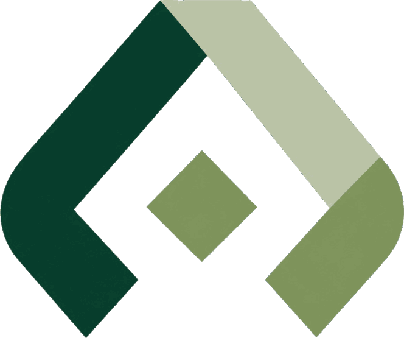
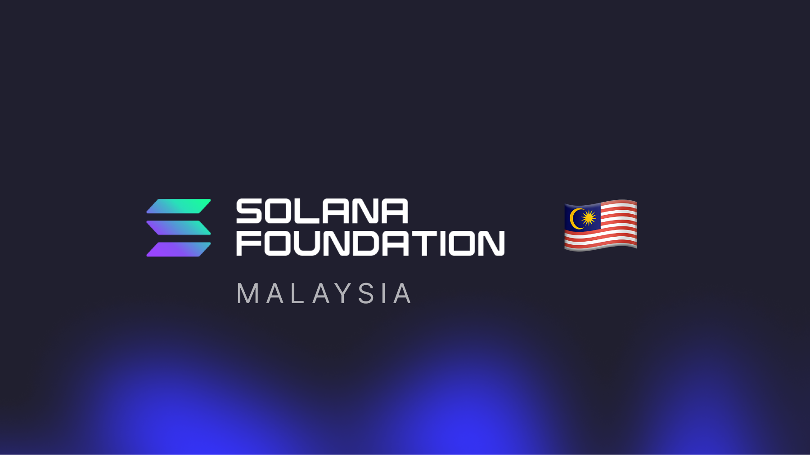

<div align="center">



# zakat.sol

### Zakat, straight from your wallet

Paste a Solana address. We price it, check it against the nisab, and hand you a
report you can actually file.

</div>

---

## What it does

Zakat is 2.5% of the wealth you have held for a lunar year — simple arithmetic,
awkward inputs. A Solana wallet is dozens of mints at moving prices, some of
which shouldn't be counted at all.

zakat.sol does the tedious part:

- **Scans** the wallet and prices every holding, dust included.
- **Sorts** what counts from what doesn't — exclude by hand, or by treatment rule.
- **Checks the nisab** against 85g gold or 595g silver at the current metal price.
- **Tracks the hawl** on the Hijri calendar, so the year-end date is the real one.
- **Exports** the whole breakdown as CSV or PDF, with a year-by-year history.

Nothing here moves your funds. It reads, prices, and adds up — that's all.

## Getting started

```bash
cp .env.example .env
pnpm install
pnpm dev
```

Then open http://localhost:3000.

---

<div align="center">


</div>

### Staking, without the guesswork

[Sanctum](https://sanctum.so) is Solana's liquid staking layer — stake SOL,
receive a liquid staking token (INF, jitoSOL, bSOL and friends) that keeps
earning while you keep using it.

Staked wealth is still your wealth, so it belongs in the calculation. The
tricky part is *how*, and that's what the `/sanctum` page covers:

- The LST counts in full at market value, exactly like spot SOL.
- Rewards are already inside the price — an LST redeems for more SOL over time,
  so adding a separate rewards line would count it twice.
- Unstake queues delay access, not ownership. A delay doesn't defer the zakat.

There's a yield estimator on that page too, so you can see what a hawl's worth
of staking does to next year's number before you commit to it.

---

<div align="center">



</div>

## Built with support from

This project is a **Superteam Microgrant** recipient, built with the support of
**Solana Foundation Malaysia** — bringing zakat tooling that Muslim Solana
holders can trust to the ecosystem.
